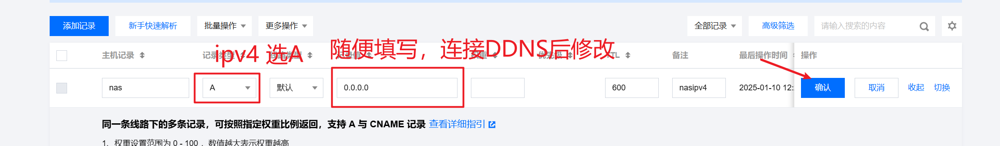
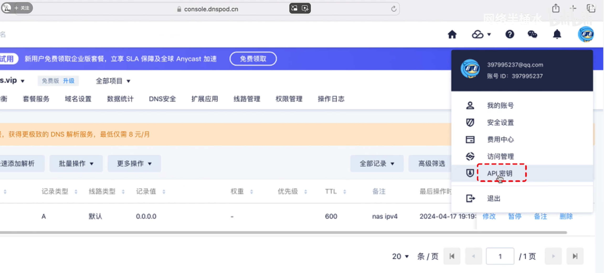
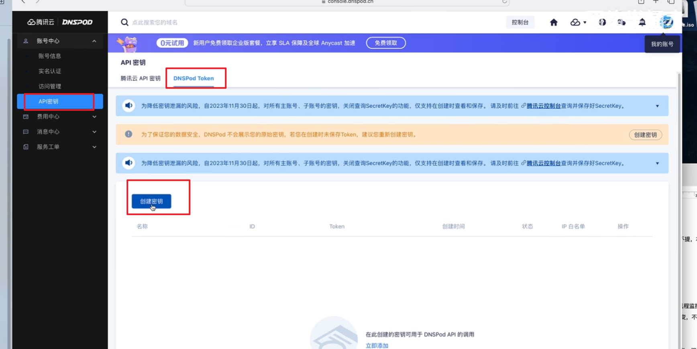
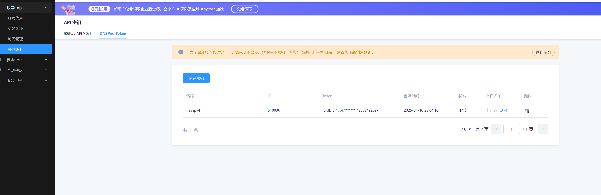
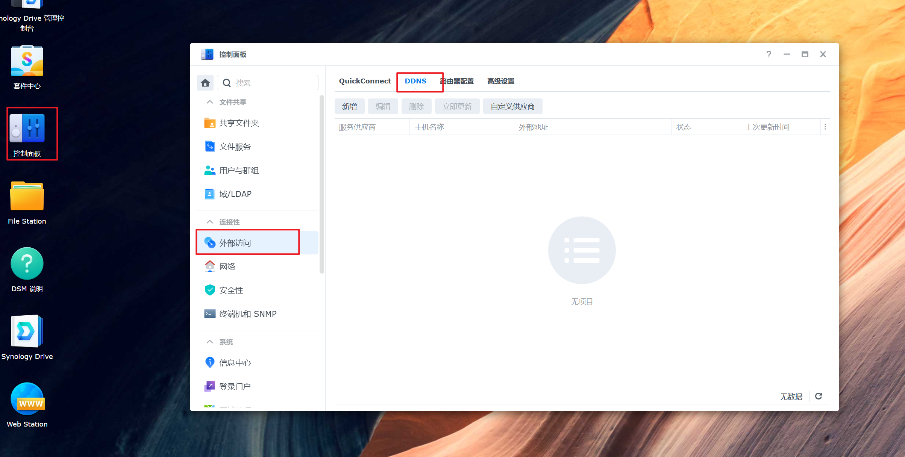
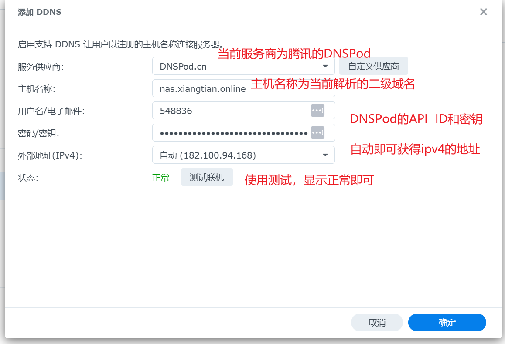
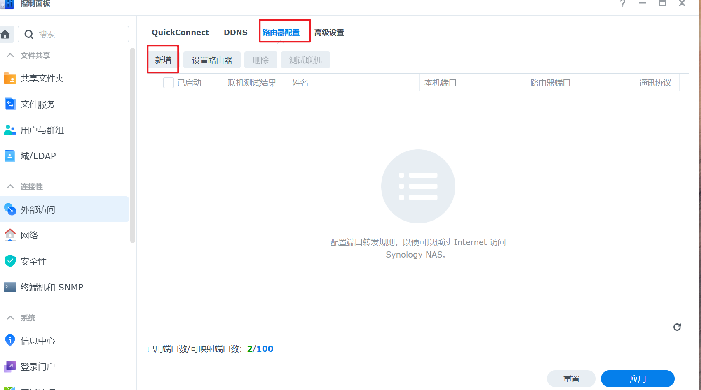

---

**本章目标：**

- 实现外网访问内网

**配置环境：**

- 电信宽带
- 群晖NASDS1522+
- 腾讯云服务
- 教程视频地址：（https://www.bilibili.com/video/BV1im411U7d4?t=339.4）

---

::: t
**前言**
本次方案必备条件：

- 公网IPv4（动态和静态都可以）
- 域名

:::

 

### 一、技术实现逻辑思维图

### 二、获取域名

- 购买注册域名

- 解析域名（使用二级或者一级都可以，看使用情况，推荐使用二级域名）

  

- 前往到DNSpod控制台（[API 密钥 - DNSPod-免费智能DNS解析服务商-电信_网通_教育网,智能DNS](https://console.dnspod.cn/account/token/apikey)）

- 在dnspod控制台获取api秘钥

  

  

- 秘钥名称随便填，token做好记录

  

### 三、 群晖DDNS设置

- 打开控制面板的外部访问中的DDNS

  

- 新增DDNS的设置方式

  

- 应用UI面板端口映射（路由器设置）

  - 设置路由器，打开路由器的Upnp功能才可以被群晖识别到

  - 添加完后新增内容

    

- 端口分配详解
  - 群晖列举的端口预设文档（[DSM 服务使用哪些网络端口？ - Synology 知识中心](https://kb.synology.cn/zh-cn/DSM/tutorial/What_network_ports_are_used_by_Synology_services)）
  - 实际配置内容
    - DSM门户
    - Gitea
    - Jellyfin媒体服务器
    - worldpress
    - Hexo

 

## 四、问题合集

1. 如何使用群晖外部访问的路由设置和端口转发功能
2. 端口转发功能是需要在光猫上执行还是主路由上执行还是随便一个都可以
3. 关于端口转发的路由模式和桥接模式都是什么意思

  - 参考教程地址（https://www.bilibili.com/video/BV1qg4y177LG?t=163.4）
  - 光猫路由模式是具备路由器的功能（分IP，wifi上网等）
    - 优点，不需要购买更多的路由器设备
    - 缺点，可能会出现网络拥堵、掉线、信号弱等问题

  - 光猫桥接模式是专注光转电信号，加强路由器的信号连接
    - 优点，可以发挥外接路由器的性能和稳定性，提高整体网络的质量和功能性（适合对网络要求高的用户）
    - 缺点，需要购买额外的路由器
4. 光猫路由模式转桥接模式的方式
  - 获取超级密码进入超级管理员页面

5. 光猫转桥接模式之后不能访问的问题

6. 连接光猫的wifi即可使其在同一网段下

7. 使用网线直接连接光猫，然后设置ipv4网段和子掩码，默认网关无，例如（192.168.1.10  ； 255.255.255.0）

