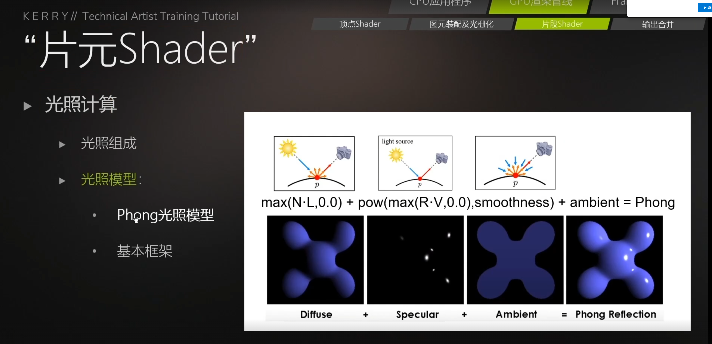
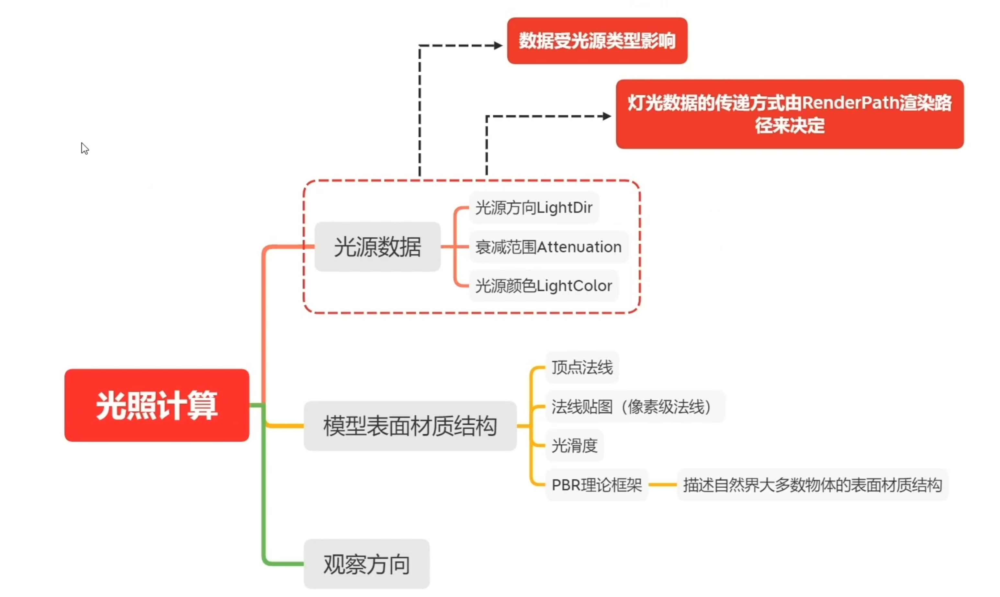
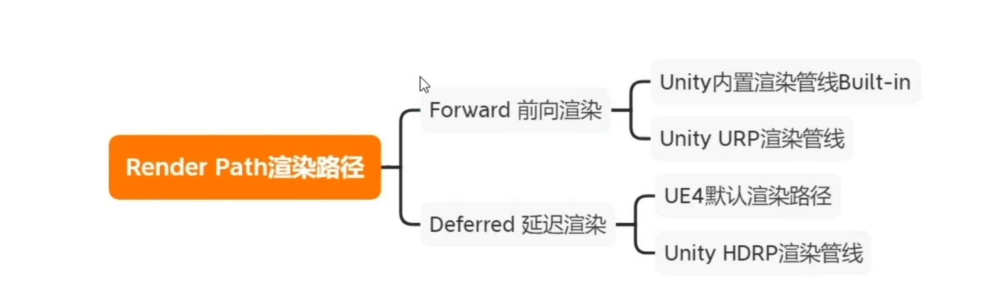

---

**本章节学习目标：** 

- 学习Unity常见的光照模型内容
- 学习光照模型原理
- 熟悉Untiy  Frame Debug

**环境配置：**

- [UnityTA学习计划](http://localhost:4000/2024/12/18/%E5%85%B6%E4%BB%96/UnityTA%E5%AD%A6%E4%B9%A0%E8%AE%A1%E5%88%92/)
- [UnityShaderASE节点全解](https://blog.maoxiang.site/2024/12/18/Shader/UnityShaderASE%E8%8A%82%E7%82%B9%E5%85%A8%E8%A7%A3/)
- VScode
- Unity2022·····
- UnityShader入门精要 

---

### 一、Frame Debug工具的使用

### 二、光照计算内容

### 二、Render Path渲染路径

#### 1、Forward 前向渲染

#### 2、Deferred 延迟渲染

