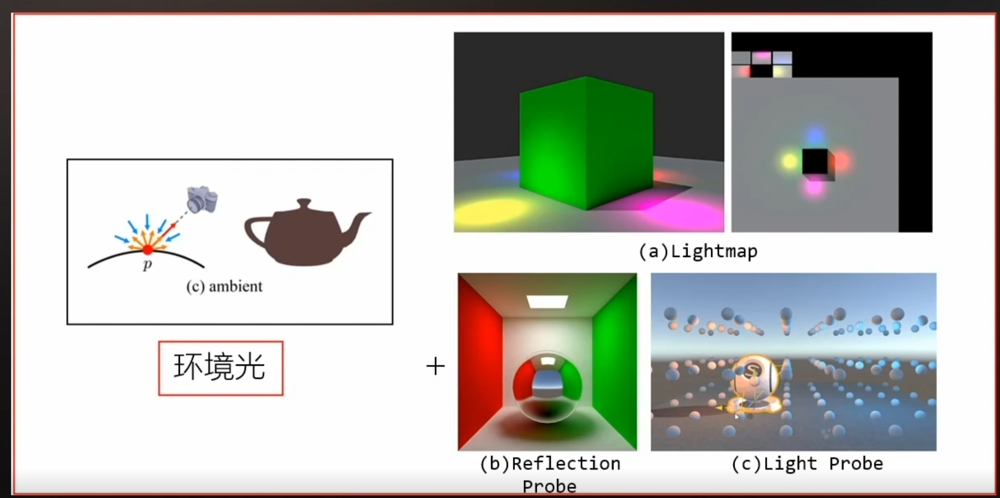
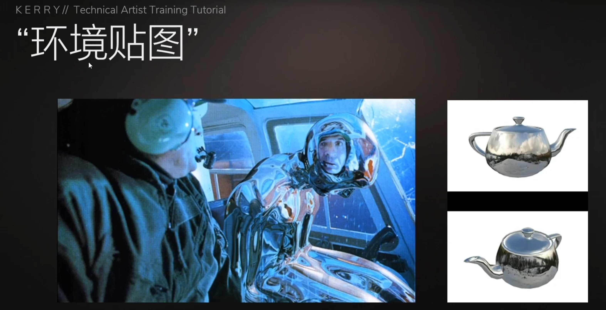
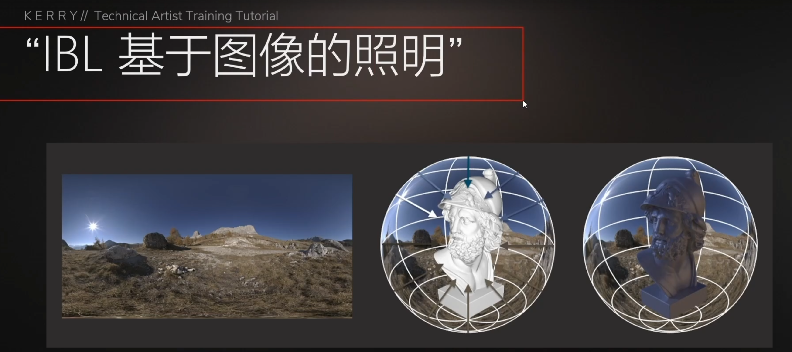
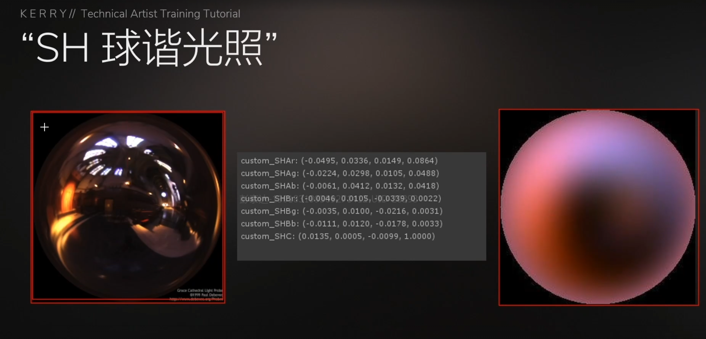
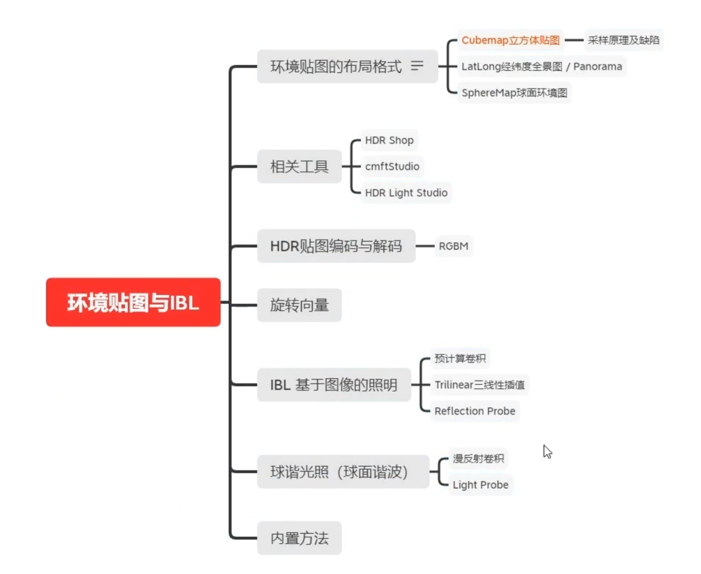
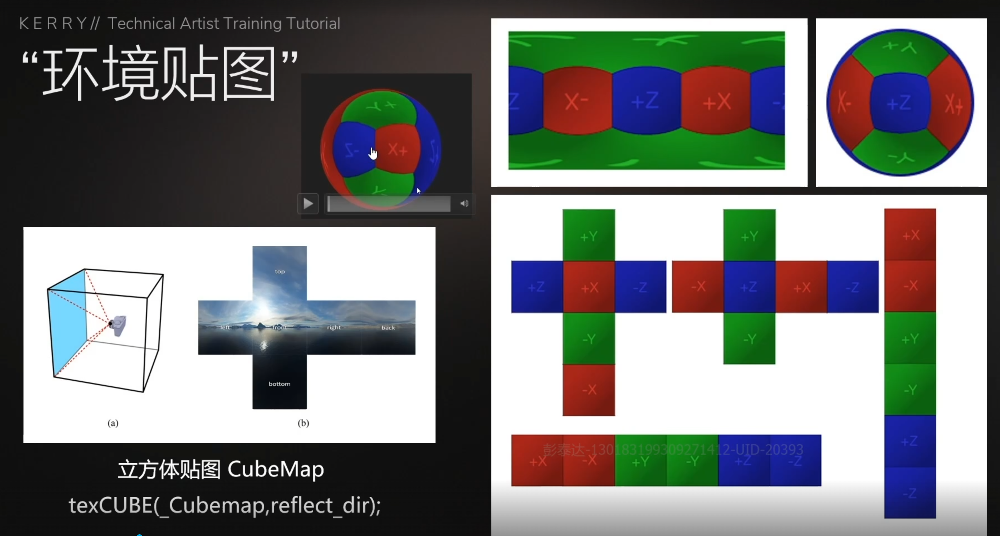
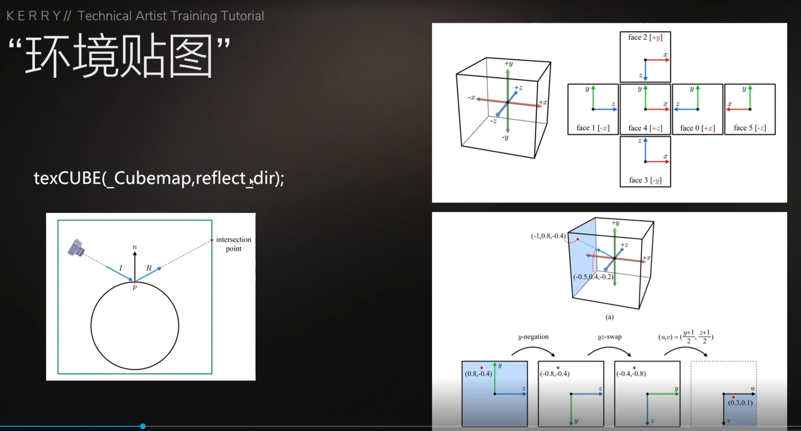

---

**本章节学习目标：** 

- 学习Unity常见的光照模型内容
- 学习掌握间接光漫反射
- 学习掌握间接光镜面反射
- 学习掌握环境贴图技术

**环境配置：**

- [UnityTA学习计划](http://localhost:4000/2024/12/18/%E5%85%B6%E4%BB%96/UnityTA%E5%AD%A6%E4%B9%A0%E8%AE%A1%E5%88%92/)
- [UnityShaderASE节点全解](https://blog.maoxiang.site/2024/12/18/Shader/UnityShaderASE%E8%8A%82%E7%82%B9%E5%85%A8%E8%A7%A3/)
- VScode
- Unity2022·····
- Shader入门精要

---

### 一、环境光模拟技术基本知识

**a Lightmap 环境光贴图**

**b Reflection Probe 反射探针 （使用环境贴图技术或者IBL技术实现）**

**c Light Probe  光照探针 （使用SH球谐光照实现）**

#### 1、技术对比

| **特性**     | **反射探针**                         | **光照探针**                               | **环境光贴图**                             |
| :----------- | :----------------------------------- | :----------------------------------------- | :----------------------------------------- |
| **作用**     | 捕捉场景的反射信息，生成环境贴图     | 捕捉场景的光照信息，存储光照数据           | 预计算场景的全局光照信息，存储为贴图       |
| **用途**     | 用于物体表面反射周围环境             | 用于动态物体的光照计算                     | 提供场景的全局光照信息，用于静态和动态物体 |
| **数据存储** | 存储环境贴图（颜色、光照等反射信息） | 存储光照数据（颜色、强度等）               | 存储全局光照信息（颜色、强度等）           |
| **放置方式** | 放置在场景的关键位置，捕捉周围环境   | 分布在场景中，动态物体根据位置获取光照信息 | 通常预计算并应用于整个场景                 |
| **适用对象** | 静态和动态物体                       | 主要用于动态物体                           | 静态和动态物体                             |
| **效果**     | 增强物体表面的反射真实感             | 确保动态物体与静态场景的光照一致           | 提供场景的整体光照效果，增强真实感         |
| **性能开销** | 较高（需生成环境贴图）               | 较低（仅存储光照数据）                     | 中等（预计算全局光照信息）                 |
| **实时性**   | 实时捕捉或预计算                     | 实时捕捉或预计算                           | 通常为预计算                               |

#### 2、技术总结

- **反射探针**：用于物体表面反射环境，增强真实感。
- **光照探针**：用于动态物体的光照计算，确保光照一致。
- **环境光贴图**：提供全局光照信息，适用于静态和动态物体，增强整体真实感。

### 二、环境贴图、IBL和SH球谐光照技术解析

#### 1、环境贴图技术（Environment Mapping）

**环境贴图技术用于模拟物体周围的环境反射和折射效果。它通过将环境信息存储在纹理中，使物体表面能够反射或折射周围环境。常见类型包括：**

- **立方体贴图（Cube Mapping）**：使用六个面的立方体纹理表示环境。
- **球面贴图（Sphere Mapping）**：使用单张纹理表示环境，适合简单场景。

#### 2、IBL基于图像的照明（Image-Based Lighting）

**IBL利用环境贴图作为光源，提供全局光照效果。它通过预计算环境贴图的辐照度，模拟复杂光照条件，常用于PBR（基于物理的渲染）中。主要步骤包括：**

- **环境贴图生成**：捕捉或生成环境贴图。
- **辐照度图计算**：预计算环境贴图的辐照度，用于漫反射光照。
- **反射光计算**：使用环境贴图计算镜面反射。

#### 3、SH球谐光照

SH球谐光照技术用球谐函数表示光照，适合低频光照的近似。它在实时渲染中用于高效计算漫反射光照，主要特点包括：

- **低频光照表示**：适合表示柔和的光照变化。
- **高效计算**：预计算光照系数，运行时计算简单。
- **压缩存储**：仅需少量系数即可表示复杂光照。

#### 4、技术对比列表

| 技术名称          | 主要用途       | 优点                      | 缺点                         | 应用场景            |
| :---------------- | :------------- | :------------------------ | :--------------------------- | :------------------ |
| 环境贴图技术      | 环境反射和折射 | 实现简单，效果逼真        | 需要高质量环境贴图           | 反射材质、天空盒    |
| IBL基于图像的照明 | 全局光照       | 提供复杂光照效果，适合PBR | 预计算复杂，存储需求大       | PBR渲染、真实感光照 |
| SH球谐光照技术    | 低频光照近似   | 计算高效，存储需求低      | 仅适合低频光照，高频细节丢失 | 实时渲染、动态光照  |

### 三、环境贴图的技术实现

