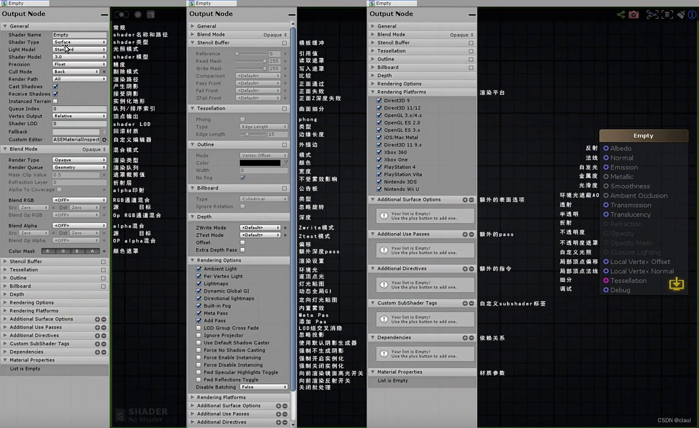
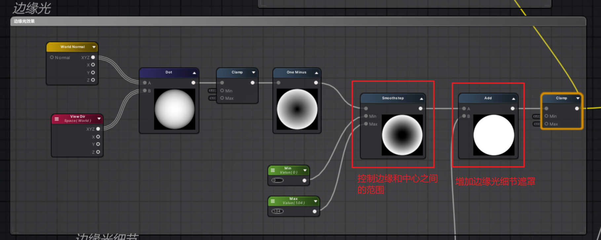
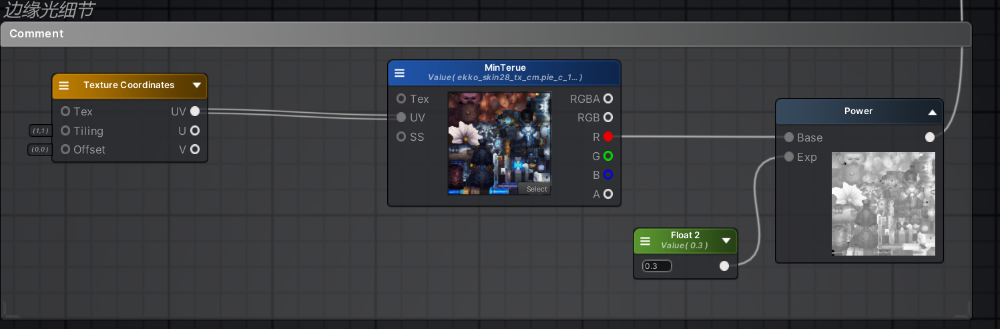
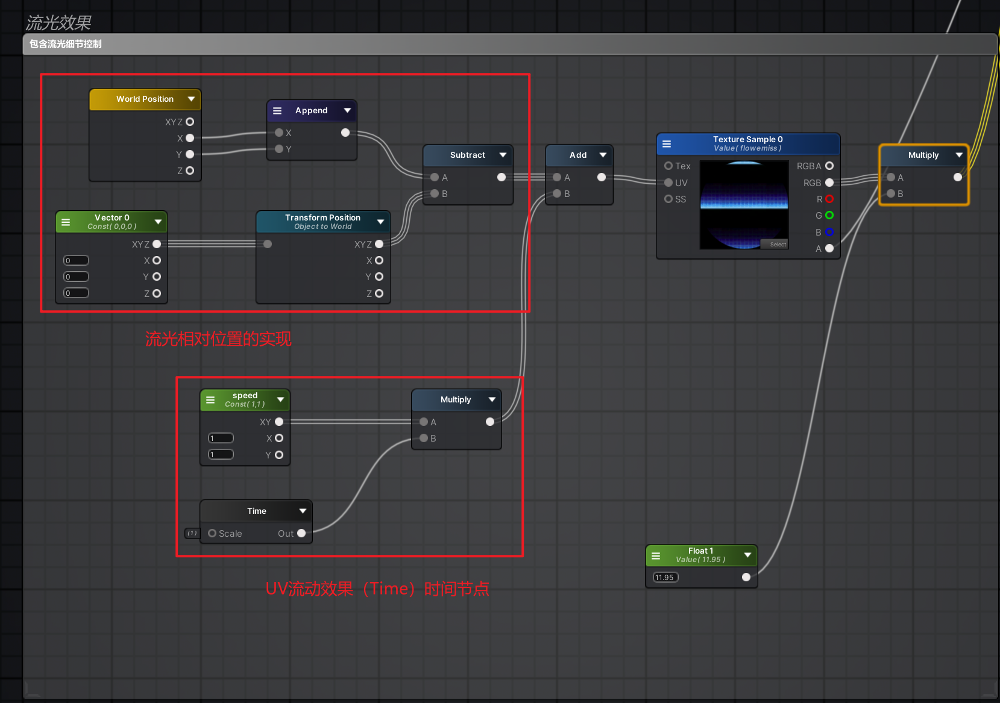
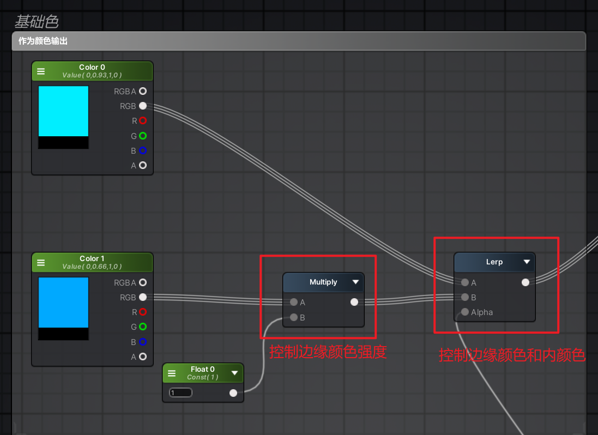

---

**本章节学习目标：** 

- 学习案例制作边缘光+流光
- 熟悉Unity ASE工具的使用

**环境配置：**

- [UnityTA学习计划](http://localhost:4000/2024/12/18/%E5%85%B6%E4%BB%96/UnityTA%E5%AD%A6%E4%B9%A0%E8%AE%A1%E5%88%92/)
- [UnityShaderASE节点全解](https://blog.maoxiang.site/2024/12/18/Shader/UnityShaderASE%E8%8A%82%E7%82%B9%E5%85%A8%E8%A7%A3/)
- VScode
- Unity2022·····
- UnityShader入门精要

---

对于ASE插件的简述：

Unity ASE（Amplify Shader Editor）是一个强大的着色器编辑插件，专为Unity开发者设计，帮助用户轻松创建和编辑复杂的着色器，以实现更好的图形效果。其作用是将shader图形化编辑。

- 付费
- 满大街破解版，学习环境可观
- 能够与Unity的多种渲染管线兼容，包括标准渲染管线、URP（通用渲染管线）和HDRP（高清渲染管线）等，适用于不同类型的Unity项目

### 一、UnityASE面板详解

### 二、常用节点和常用快捷键

- [UnityShaderASE节点全解](https://blog.maoxiang.site/2024/12/18/Shader/UnityShaderASE%E8%8A%82%E7%82%B9%E5%85%A8%E8%A7%A3/)

- 由于UnityShaderASE和UE蓝图操作类似，所以跨软件门槛低。

### 三、案例内容知识点分解

#### 1、UnityShaderASE的实现效果

- 混合模式内容的涉及
- 贴图叠加的内容涉及
- time节点的引用

##### （1）边缘光效果的实现

- 模型世界法线和相机法线点乘之后的值在（1，-1）之间需要进行值约束【Clamp】
- 使用Smoothstep节点控制边缘和中心的羽化值
- Alpha值的范围再【0-1】，使用之前可以使用Clamp节点进行约束

##### （2）流光效果的实现

- 流动流光相对位置的实现【世界位置的xy-模型所在位置】Transform Position节点表示模型当前位置
- UV流动效果的使用，使用Time节点实现，并用乘法控制其速度
- UV流动需要用的是Add

##### （3）基础色

#### 2、UnityShader代码实现效果

##### （1）边缘光效果的实现

##### （2）流光效果的实现

##### （3）贴图合并
