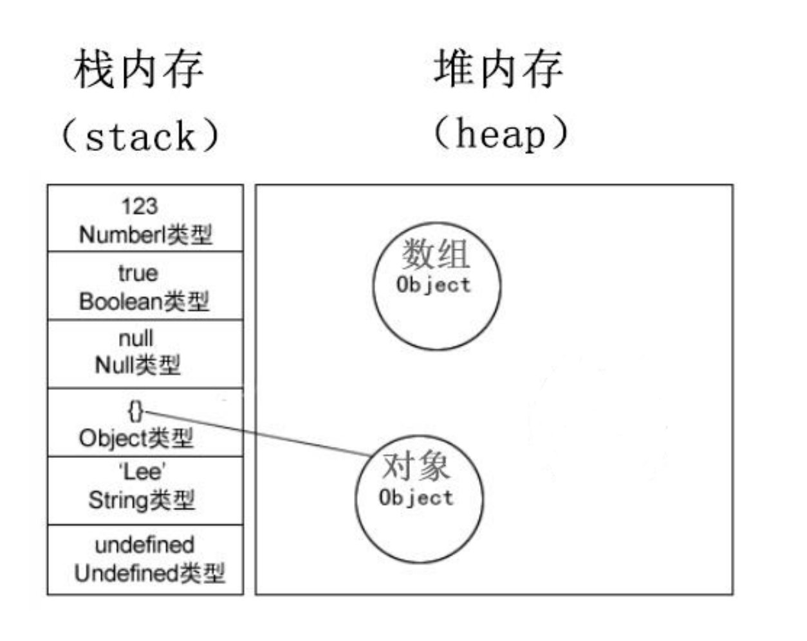
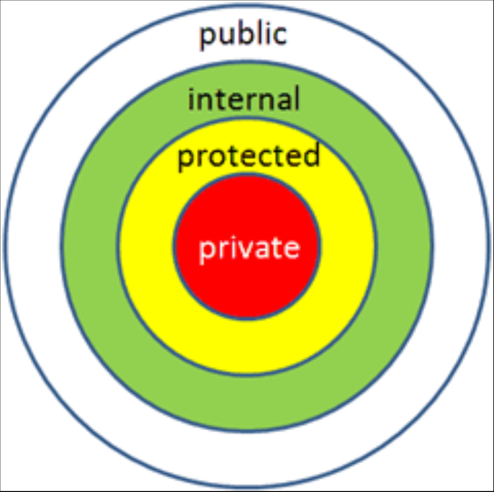
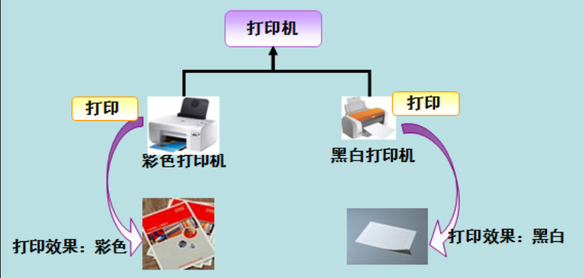

---

**本章节学习目标：** 

- 学习C#语言基础
- 打好C#面相对象的基础


**环境配置：**

- [UnityTA学习计划](http://localhost:4000/2024/12/18/其他/UnityTA学习计划/)
- 学习教程（[C#编程-第二季-面向对象-宇宙最简单2021最新版](https://www.bilibili.com/video/BV1RL411T7Ai?t=19.8)）
- 参考网址（[C# 教程 | 菜鸟教程](https://www.runoob.com/csharp/csharp-tutorial.html)）
- VScode
- JetBrains Rider 2024
- Unity2022·····

---

## 一、调试和错误处理

1、什么是调试和错误处理？

- **调试**是识别、定位和修复程序中的错误（bug）的过程。调试通常涉及逐步执行代码、检查变量状态、输出中间结果等，以找出问题的根源。

- **错误处理**是指在程序中预见可能的错误，并编写代码来处理这些错误，防止程序崩溃或产生不可预期的结果。常见的错误处理方式包括使用异常处理机制（如 `try-catch` 块）来捕获和处理异常。

2、使用输出语句和Debug模式调试程序

- **使用输出语句调试**：通过在代码中插入输出语句（如 `Console.WriteLine`），输出变量的值或程序执行到某一步的状态。

  ```csharp
  int x = 10;
  Console.WriteLine("x 的值是: " + x); // 输出 x 的值
  ```

  

- **使用Debug模式调试**：在 Visual Studio 等 IDE 中，可以使用 Debug 模式设置断点，逐步执行代码，查看变量的值、调用栈等信息。

3、中断模式下的窗口介绍

在 Debug 模式下，程序执行到断点时会进入**中断模式**。此时，程序暂停执行，开发者可以查看和修改变量的值，检查调用栈等。常见的窗口包括：

- **局部变量窗口**：显示当前作用域内的变量及其值。
- **调用堆栈窗口**：显示当前函数的调用链，帮助理解程序的执行流程。
- **监视窗口**：允许开发者添加特定的变量或表达式进行监视。
- **输出窗口**：显示程序的输出信息，如调试信息、错误信息等。

4、逐语句逐过程（中断模式）

在中断模式下，开发者可以逐步执行代码：

- **逐语句（Step Into）**：执行当前行的代码，如果遇到函数调用，会进入该函数内部，继续逐行执行。
- **逐过程（Step Over）**：执行当前行的代码，如果遇到函数调用，不会进入函数内部，而是将整个函数作为一步执行。
- **跳出（Step Out）**：如果当前在某个函数内部，执行该函数的剩余部分，并返回到调用该函数的地方。

5、关于程序中的异常

- **异常**是程序运行时发生的错误或意外情况。常见的异常包括除以零、空指针引用、数组越界等。异常会中断程序的正常执行流程，如果没有处理，程序可能会崩溃。

  ```csharp
  try
  {
      int result = 10 / 0; // 除以零会抛出 DivideByZeroException
  }
  catch (DivideByZeroException ex)
  {
      Console.WriteLine("错误: " + ex.Message); // 捕获并处理异常
  }
  ```

  

- C# 提供了异常处理机制，允许开发者捕获并处理异常，从而避免程序崩溃。例如，使用 `try-catch` 块来捕获异常。

6、使用trycatch检查用户输入的数据是否合法

`try-catch` 结构可以用来捕获和处理用户输入时可能出现的异常。例如，检查用户输入的是否是一个合法的整数：

```csharp
//try 中放置可能出现异常的代码
try
{
    Console.Write("请输入一个整数: ");
    string userInput = Console.ReadLine();
    int number = int.Parse(userInput); // 尝试将输入转换为整数
    Console.WriteLine("你输入的整数是: " + number);
}
//catch代表我们要捕捉哪些异常
catch (FormatException)
{
    Console.WriteLine("输入的不是一个合法的整数！");
}
catch (Exception ex)
{
    Console.WriteLine("发生错误: " + ex.Message);
}
//finally代表不管任何情况都能执行的代码
finally
{
    
}
```

## 二、什么是面相对象的编程？

### 1、什么是面向对象的编程？

- **面向对象编程（Object-Oriented Programming，OOP）** 是一种编程范式，它以“对象”为核心来组织代码和数据。对象是现实世界中事物的抽象，包含属性（数据）和方法（行为）。OOP 的核心思想是将程序分解为多个相互独立的对象，每个对象负责特定的功能。

- **OOP 的四大基本特性：**

  1. **封装（Encapsulation）**：
     - 将数据（属性）和行为（方法）封装在一个对象中。
     - 隐藏内部实现细节，只暴露必要的接口。
     - 例如：类的私有字段和公共方法。

  2. **继承（Inheritance）**：

  - 允许一个类（子类）继承另一个类（父类）的属性和方法。
  - 支持代码复用和层次化设计。
  - 例如：`Dog` 类继承自 `Animal` 类。

  3. **多态（Polymorphism）**：

  - 同一个方法在不同对象中有不同的实现。
  - 通过接口或父类引用调用子类的方法。
  - 例如：`Animal` 类的 `Speak` 方法在 `Dog` 和 `Cat` 类中有不同的实现。

  4. **抽象（Abstraction）**：

  - 提取对象的共同特征，忽略不必要的细节。
  - 通过抽象类或接口定义通用的行为。
  - 例如：定义一个 `Shape` 抽象类，包含 `Draw` 方法。

### 2、为什么使用面向对象的编程？

1. 使用面向对象编程的主要原因是它能够更好地组织和管理复杂的代码，提高代码的可维护性、可扩展性和复用性。

   1. **代码复用**

   - 通过继承和组合，可以复用已有的代码，减少重复编写代码的工作量。
   - 例如：多个类可以共享父类的属性和方法。

   2. **模块化设计**

   - 将程序分解为多个独立的对象，每个对象负责特定的功能。
   - 模块化设计使得代码更易于理解和维护。

   3. **易于维护和扩展**

   - 封装隐藏了对象的内部实现细节，修改对象的内部逻辑不会影响其他部分的代码。
   - 通过继承和多态，可以轻松扩展程序的功能。

   4. **提高代码的可读性**

   - 面向对象的代码更接近现实世界的模型，易于理解和描述。
   - 例如：将“学生”和“课程”建模为对象，代码逻辑更直观。

   5. **支持团队协作**

   - 不同的开发者可以负责不同的对象或模块，降低代码冲突的风险。
   - 通过定义清晰的接口，团队成员可以并行开发。

   6. **更好的错误处理**

   - 通过封装和抽象，可以将错误限制在局部范围内，避免错误扩散到整个程序。
   - 例如：在对象内部处理异常，外部调用者无需关心细节。

   7. **模拟现实世界**

   - 面向对象编程能够更好地模拟现实世界中的事物和关系。
   - 例如：将“汽车”建模为一个对象，包含属性（颜色、品牌）和方法（启动、停止）。

2. 面相对象实例：

   ```csharp
   using System;
   
   // 父类：动物
   class Animal
   {
       public string Name { get; set; }
   
       public Animal(string name)
       {
           Name = name;
       }
   
       // 虚方法，子类可以重写
       public virtual void Speak()
       {
           Console.WriteLine("动物发出声音");
       }
   }
   
   // 子类：狗
   class Dog : Animal
   {
       public Dog(string name) : base(name) { }
   
       // 重写父类的方法
       public override void Speak()
       {
           Console.WriteLine($"{Name} 汪汪叫");
       }
   }
   
   // 子类：猫
   class Cat : Animal
   {
       public Cat(string name) : base(name) { }
   
       // 重写父类的方法
       public override void Speak()
       {
           Console.WriteLine($"{Name} 喵喵叫");
       }
   }
   
   class Program
   {
       static void Main(string[] args)
       {
           Animal myDog = new Dog("小黑");
           Animal myCat = new Cat("小白");
   
           myDog.Speak(); // 输出：小黑 汪汪叫
           myCat.Speak(); // 输出：小白 喵喵叫
       }
   }
   ```

   

## 三、类

### 1、定义类

```csharp
//类的定义是以关键字 class 开始，后跟类的名称。类的主体，包含在一对花括号内。下面是类定义的一般形式：
<access specifier> class  class_name 
{
    // member variables
    <access specifier> <data type> variable1;
    <access specifier> <data type> variable2;
    ...
    <access specifier> <data type> variableN;
    // member methods
    <access specifier> <return type> method1(parameter_list) 
    {
        // method body 
    }
    <access specifier> <return type> method2(parameter_list) 
    {
        // method body 
    }
    ...
    <access specifier> <return type> methodN(parameter_list) 
    {
        // method body 
    }
}
//请注意：

//访问标识符 <access specifier> 指定了对类及其成员的访问规则。如果没有指定，则使用默认的访问标识符。类的默认访问标识符是 internal，成员的默认访问标识符是 private。
//数据类型 <data type> 指定了变量的类型，返回类型 <return type> 指定了返回的方法返回的数据类型。
//如果要访问类的成员，你要使用点（.）运算符。
//点运算符链接了对象的名称和成员的名称。
```


### 2、创建对象和使用对象

```csharp
//创建一个Box类并使用
using System;
namespace BoxApplication
{
    class Box
    {
       public double length;   // 长度
       public double breadth;  // 宽度
       public double height;   // 高度
    }
    class Boxtester
    {
        static void Main(string[] args)
        {
            Box Box1 = new Box();        // 声明 Box1，类型为 Box
            Box Box2 = new Box();        // 声明 Box2，类型为 Box
            double volume = 0.0;         // 体积

            // Box1 详述
            Box1.height = 5.0;
            Box1.length = 6.0;
            Box1.breadth = 7.0;

            // Box2 详述
            Box2.height = 10.0;
            Box2.length = 12.0;
            Box2.breadth = 13.0;
           
            // Box1 的体积
            volume = Box1.height * Box1.length * Box1.breadth;
            Console.WriteLine("Box1 的体积： {0}",  volume);

            // Box2 的体积
            volume = Box2.height * Box2.length * Box2.breadth;
            Console.WriteLine("Box2 的体积： {0}", volume);
            Console.ReadKey();
        }
    }
}
```


###   3、类的使用案例（车辆和向量类的定义和使用）

1. #### 定义一个车辆类，具有Run和Stop等方法，具有Speed速度MaxSpeed、Weight等域。

   - 定义一个车辆类

   ```
   
   ```

   

## 四、访问权限控制

### 1、public

- **定义**：`public` 是一种访问修饰符，表示被修饰的成员（如方法、变量、类等）可以被任何其他类访问。
- **使用场景**：
  - 当你需要让类的成员可以被其他类调用或访问时，使用 `public`。
  - 例如，类的公共方法通常用于提供接口，供其他类调用。

### 2、private

- **定义**：`private` 是一种访问修饰符，表示被修饰的成员只能在定义它的类内部被访问，其他类无法直接访问。
- **使用场景**：
  - 当你需要隐藏类的内部实现细节，只通过公共方法暴露功能时，使用 `private`。
  - 这有助于封装类的内部状态，防止外部直接修改内部数据。

## 五、构造函数

### 1、什么是构造函数？

### 2、构造函数的参数问题

### 3、子类的构造函数

1、子类构造函数

```csharp
class Boss:Aoss
{
	
}
```

2、调用父类的构造函数

## 六、属性

### 1、属性的书写

```csharp
//非属性写法
private int age；
//设置属性
public void SetAge（int age）
{
	this.age = age;
}
//获取属性
public int GetAge（int age）
{
	return age；
}

...Main()
{
    Cus lisi = new Cus();
    lisi.SetAge();
    Console.WriteLine(lisi.GetAge());
}

//属性的写法
public int Age
{
    get
    {
        return age；
    }
    set//Value,通过Value获取外部的值。
    {
        age = value;
    }
}
...Main()
{
    Cus lisi = new Cus();
    lisi.Age = 10;
}
```

### 2、自动属性、只读只写属性和匿名类型

1. 属性

```csharp
//只读或者只写
//只读
public int Age
{
    get
    {
        return age；
    }
}
//只写
public int Age
{
    set//Value,通过Value获取外部的值。
    {
        age = value;
    }
}

//自动创建private int age成员
public int Age {get； set；}

//自动创建模式只读只写
//只写
public int Age {get；Private set；}
//只读
public int Age {get；Private set；}
```

### 3、匿名类型

```csharp
int age = 12;
var age = 12;
var age ="dslajflajl";
```


## 七、堆栈和静态存储区

### **1. 栈（Stack）**

栈是一种后进先出（LIFO，Last In First Out）的数据结构，用于存储程序运行时的局部变量、函数调用的上下文信息（如返回地址、参数等）。

#### **特点**

1. **自动分配和释放**：
   - 当函数被调用时，系统会为其分配一块内存空间（称为栈帧，Stack Frame），用于存储局部变量和函数调用的上下文信息。
   - 当函数执行完毕后，栈帧会自动被释放，占用的内存空间也会被回收。
   - 因此，栈中的数据生命周期仅限于函数的执行过程。
2. **局部变量存储**：
   - 栈主要用于存储局部变量（在函数内部定义的变量）。
   - 局部变量在函数调用时分配内存，在函数返回时释放内存。
3. **效率高**：
   - 栈的分配和释放操作非常快，因为它们是连续的内存空间，且操作简单。
4. **大小有限**：
   - 栈的大小通常由系统预先分配，且有限制（例如，几 MB）。如果栈空间不足，会导致栈溢出（Stack Overflow）错误。
5. **线程独立**：
   - 每个线程都有自己的栈空间，线程之间的栈是隔离的。

```csharp
void myFunction() {
    int localVar = 10; // 局部变量存储在栈中
}
```

### **2. 堆（Heap）**

堆是一种动态分配的内存区域，用于存储动态分配的对象和数据。它由程序员手动管理，通常通过编程语言提供的内存分配和释放函数（如 C/C++ 中的 `malloc`/`free` 或 Java 中的 `new`）来操作。

#### **特点**

1. **手动分配和释放**：
   - 程序员需要显式地分配和释放堆内存。
   - 如果忘记释放，会导致内存泄漏（Memory Leak）；如果释放后继续访问，会导致未定义行为。
2. **动态分配**：
   - 堆内存的大小可以在运行时动态调整，适合存储大小不确定或需要长期存在的数据。
3. **生命周期灵活**：
   - 堆中的数据生命周期由程序员控制，可以跨越多个函数调用。
4. **大小较大**：
   - 堆的大小通常比栈大得多，适合存储大量数据。
5. **碎片化问题**：
   - 频繁的分配和释放可能导致内存碎片化，降低效率。

```csharp
#include <stdlib.h>

void myFunction() {
    int* dynamicVar = (int*)malloc(sizeof(int)); // 在堆上分配内存
    *dynamicVar = 20;
    free(dynamicVar); // 手动释放内存
}
```

### **3. 静态存储区（Static Storage Area）**

静态存储区用于存储静态变量（Static Variables）和全局变量（Global Variables）。这些变量的生命周期贯穿整个程序的运行过程。

#### **特点**

1. **生命周期长**：
   - 静态变量和全局变量在程序启动时分配内存，在程序结束时释放内存。
   - 它们的生命周期与程序的运行时间相同，而不是函数的调用过程。
2. **全局或类级别访问**：
   - 全局变量可以在程序的任何地方访问（只要作用域允许）。
   - 静态变量可以在类的范围内访问，但不会随着对象的创建和销毁而改变。
3. **自动初始化**：
   - 静态变量和全局变量在程序启动时自动初始化为零（如果未显式初始化）。
4. **存储位置固定**：
   - 静态存储区的大小在程序编译时确定，运行时不会改变。

```csharp
int globalVar = 10; // 全局变量，存储在静态存储区

void myFunction() {
    static int staticVar = 20; // 静态变量，存储在静态存储区
    staticVar++;
    printf("StaticVar: %d\n", staticVar);
}
```


## 八、值类型和引用类型



1. 类型被分为两种：值类型(整数，bool struct char ⼩数)和引⽤类型（string 数组 ⾃定义的类，内置的类）。

2. 值类型只需要⼀段单独的内存，⽤于存储实际的数据，（单独定义的时候放在栈中）

3. 引⽤类型需要两段内存

4. 第⼀段存储实际的数据，它总是位于堆中

5. 第⼆段是⼀个引⽤，指向数据在堆中的存放位置

## 九、封装、继承和多态

### 1、封装

1. **封装** 被定义为"把一个或多个项目封闭在一个物理的或者逻辑的包中"。在面向对象程序设计方法论中，封装是为了防止对实现细节的访问。
2. C# 封装根据具体的需要，设置使用者的访问权限，并通过**访问修饰符** 来实现。
3. 一个 **访问修饰符** 定义了一个类成员的范围和可见性。C# 支持的访问修饰符如下所示：
   - public：所有对象都可以访问；
   - private：对象本身在对象内部可以访问；
   - protected：只有该类对象及其子类对象可以访问
   - internal：同一个程序集的对象可以访问；
   - protected internal：访问限于当前程序集或派生自包含类的类型。



### 2、继承

1. 继承是什么？

   很多类中有相似的数据，⽐如在⼀个游戏中，有Boss类，⼩怪类Enemy，这些类他们有很多相同的属性，有不同的，这个时候我们可以使⽤继承来让这两个类继承⾃同⼀个类。

2. 继承的类型

   - 实现继承

     <p id = "paragraph">表⽰⼀个类型派⽣于⼀个基类型,它拥有该基类型的所有成员字段和函数。 在实现继

     承中,派⽣类型采⽤基类型的每个函数的实现代码,除⾮在派⽣类型的定义中指定重写

     某个函数的实现代码。 在需要给现有的类型添加功能,或许多相关的类型共享⼀组重

     要的公共功能时,这种类型的继承⾮常有⽤。</p>

   - 接口继承

     <p id = "paragraph">表⽰⼀个类型只继承了函数的签名,没有继承任何实现代码。 在需要指定该类型具有
     某些可⽤的特性时,最好使⽤这种类型的继承。</p>

   - 多重继承

     <p id = "paragraph">⼀些语⾔(C++)⽀持所谓的 “多重继承”,即⼀个类派⽣⾃多个类。 使⽤多重继承的优点是
     有争议的:⼀⽅⾯,毫⽆疑问,可 以使⽤多重继承编写⾮常复杂、 但很紧凑的代码,。另⼀⽅
     ⾯,使⽤多重实现继承的代码常常很难理解和调试。 如前所述,简化健壮代码的编写⼯作是
     开发 C#的重要设计 ⽬标。 因此,C#不⽀持多重实现继承。 ⽽ C#允许类型派⽣⾃多个接
     Unity 1143 C#编程-第⼆季-⾯向对象 16
     ⼝— — 多重接⼝继承。 这说明,C#类可以派⽣⾃另⼀个类和任意多个接⼝。更准确地说,
     System.Object 是⼀个公共的基类,所 以每个 C#(除了Object类之外)都有⼀个基类,还可以
     有任意多个基接 ⼝。</p>

### 3、多态

- 多态是同一个行为具有多个不同表现形式或形态的能力。

- **多态性**意味着有多重形式。在面向对象编程范式中，多态性往往表现为"一个接口，多个功能"。

- 多态性可以是静态的或动态的。在**静态多态性**中，函数的响应是在编译时发生的。在**动态多态性**中，函数的响应是在运行时发生的。

- 在 C# 中，每个类型都是多态的，因为包括用户定义类型在内的所有类型都继承自 Object。

- 多态就是同一个接口，使用不同的实例而执行不同操作，如图所示：

  

## 十、继承中子类父类的方法重写（虚方法和隐藏方法）

### 1、什么是虚方法（virtual）？

在继承中，子类需要对父类的方法进行重写，用到的方法就是虚方法。

### 2、虚方法实例

```csharp
//1、把⼀个基类函数声明为virtual,就可以在任何派⽣类中重写该函数:
class MyBaseClass
{
	public virtual string VirtualMethod()
    {
	return "Method is called in base class";
    }
}
```

```csharp
//2、在派⽣类中重写另外⼀个函数时，要使⽤override关键字显⽰声明
class MyDerivedClass:MyBaseClass
{
	public override string VirtualMethod()
    {
	return "Method is called in derivedclass.";
    }
}
```

```csharp
...main()
{
	
}
```


### 3、隐藏方法

隐藏继承的成员。


### 4、隐藏方法实例

```
//隐藏方法的使用
public new void AI()
{
	Console.WriteLine("Boss自己的AI");
}

//方法实例
...Main()
{
    Boss b = new Boss();
    b.AI();
}
```

## 十一、抽象类和密封类

### 1、抽象类

1. C#允许把类和函数声明为 abstract。 抽象类不能实例化,抽象类可以包含普通函数和抽象

2. 函数，抽象函数就是只有函数定义没有函数体。 显然,抽象函数本⾝也是虚拟的Virtual(只有函数定义，没有函数体实现)。

3. **类是⼀个模板，那么抽象类就是⼀个不完整的模板，我们不能使⽤不完整的模板去构造对象。**

4. 实例：

   ```csharp
   abstract class Building
   {
   	public abstract decimal CalculateHeatingCost();
   }
   ```

   

### 2、密封类和密封方法

1. C#允许把类和⽅法声明为 sealed。

2.  对于类 ,这表⽰不能继承该类；

3. 对于⽅法表⽰不能重写该⽅法。

4. 实例：

   ```csharp
   sealed FinalClass
   {
   // etc
   }
   ```

3. 什么时候使⽤ 密封类和密封⽅法？

   - 防⽌重写某些类导致代码混乱

   - 商业原因
   - 实例：

   ```csharp
   class Child:Base
   {
   	
   }
   ```

   

## 索引器

## 运算符重载

## 列表

## 泛型
